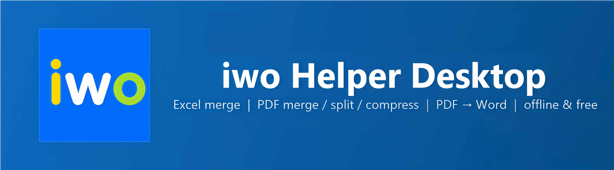

<div align="center">



<br>

[](https://github.com/DedovMosol/iwoHelperDesktop/actions/workflows/ci.yml)
[](https://github.com/DedovMosol/iwoHelperDesktop/releases/latest)
[](https://github.com/DedovMosol/iwoHelperDesktop/releases)
[](LICENSE)
[](docs/PRIVACY.md)

[](https://dotnet.microsoft.com/download/dotnet-framework/net48)

**Free, offline office tools in a single Windows app — merge Excel sheets, merge/split/compress PDFs at Acrobat‑level quality, and turn born‑digital PDFs back into editable Word. No subscription, no admin rights, no network.**

[](https://github.com/DedovMosol/iwoHelperDesktop/releases/latest)
[](https://github.com/DedovMosol/iwoHelperDesktop/releases/latest)

📐 [Architecture](docs/ARCHITECTURE.md) · 🤝 [Contributing](CONTRIBUTING.md) · 📋 [Changelog](docs/CHANGELOG.md) · 🔒 [Privacy](docs/PRIVACY.md)

</div>

## What is iwo Helper Desktop?

A small, self‑contained Windows application that bundles the office tasks people do every day with `.xlsx` and `.pdf` files — without a paid suite. It runs **offline**, needs **no administrator rights**, makes **no network calls**, and ships either as a single portable `.exe` or a per‑user installer.

## 🚀 Features

- 📊 **Excel Digest** — merges the first visible sheet of every workbook in a folder into one file (`.xlsx`/`.xlsm`/`.xlsb`/`.xls`), keeping all formatting (styles, formulas, charts, pivots). It adds a table of contents, optional formula→value conversion, and a Word cover note (GOST R 7.0.97‑2016).
- 📄 **PDF Merge** — build one PDF from several: a thumbnail grid with page numbers, reorder by dragging (the grid auto‑scrolls at the edges) or **cut/copy/paste pages** (Ctrl+X/C/V) with an insertion caret for precise long‑distance moves, **rotate pages 90°** (right‑click or Ctrl+Shift+«+»/«−»), jump to a page with Ctrl+G, and **drop more PDFs straight onto the grid** — their pages land at the drop position. Pages are copied **as‑is** — scans, stamps and signatures are not distorted (rotation is written as page metadata).
- ✂️ **PDF Split** — extract selected pages into one file, or split by page ranges, every N pages, or top‑level bookmarks. Original page numbers under the thumbnails, Ctrl+G to jump, and per‑page **rotation** that is carried into the produced files in every mode. The source is never modified.
- 📝 **PDF → Word** — extract the text layer of one or **several born‑digital** PDFs (saved from Word, “Microsoft Print to PDF”, exported from a browser) into a single editable `.docx`. Inherits the font family, size, bold/italic, underline, colour, super/subscript, paragraph alignment (left/justify/centre — including a multi‑line centred title kept as one block) and first‑line indent, per‑page size and orientation (portrait/landscape) and margins, images (placed in reading order, a centred logo kept centred) and hyperlinks. Spacing is single with no extra gaps between paragraphs, so a dense document keeps its original page count on any machine. **Bordered tables are reconstructed as real Word tables** — column widths from the ruling, merged cells (colspan/rowspan), and per‑cell text. **Numbered and bulleted lists become native Word lists** — the source marker (`1.`, `•`, `—`, …) is dropped and Word draws its own, numbering continuing across text nested in an item and restarting for a new list. **An electronic‑signature seal transfers as an image** — both a picture seal and a *text*‑drawn seal (rendered and placed as a picture so its look is preserved). Add several PDFs at once (drop them straight onto the page grid to insert at a spot); every file’s pages appear in one thumbnail grid with position numbers where you can reorder by dragging (or ◀ Earlier / Later ▶), move pages across the whole set with cut/copy/paste (Ctrl+X/C/V), jump with Ctrl+G, and drop pages you don’t need, so Word gets them — from all files — in exactly the order shown. **Multi‑column layouts are read in the correct order** — a two‑column letterhead comes out as coherent blocks (the left column in full, then the right one), not as interleaved lines. Text drawn twice with a tiny offset (the “pseudo‑bold” of some tickets) is de‑duplicated and set in real bold, and rotated service text is dropped instead of shredding into single letters. Page margins account for images, so a logo above the heading no longer pushes the content down. A **two‑column letterhead is laid out side by side** — a header that splits into columns (a letterhead on the left, an addressee block on the right) becomes a borderless table so the columns sit next to each other, with a logo centred above its column. A **label/value form with no ruling** (a receipt‑style layout) is rebuilt as a borderless Word table so the pairs stay on their rows, and the vertical spacing between groups of fields is kept. Fill‑in **blank lines** (`______ №  ______`) are kept as underscore placeholders. **Images with a soft transparency mask** (a logo, a stamp) are composited onto white instead of coming out on a black background. **Intentional line breaks survive** — multi‑line signatures, requisite lines and contact footers stay as separate lines instead of being re‑flowed, and a name opposite the *last* line of a signature block stays at that height. **The vertical rhythm of the page is reproduced** — blank space between zones (an addressee block, attachments, an executor line at the bottom of a sparse page) is carried over, with a pagination guard so no document gains pages. **Compound words keep their hyphen** at a line break (office suites don’t auto‑hyphenate, so a trailing hyphen is part of the word), and small digits‑only footnote marks are recognised by font size even when their glyph box sits on the baseline. **A date/number imprint stamped over a fill‑in form** transfers as the image it is — the form placeholders underneath and invisible white service marks are dropped instead of duplicating the content. **Single‑row side‑by‑side zones** (requisites on the left, a registry note on the right) are laid out next to each other, and narrow right‑hand notes keep their horizontal position. First‑line indents are applied per paragraph from the source — footnotes and executor lines no longer inherit a false document‑wide indent. Cyrillic text is set only in Word‑native font families (falling back to Times New Roman) so it is never letter‑spaced by the East‑Asian justification path. If a font used in the PDF is not installed, the text is set in Times New Roman. Scanned documents are not supported yet — a clear message is shown instantly (page images are not even decoded) and the file is untouched.
- 🗜️ **PDF Compression** — Acrobat‑level “Reduce File Size”: downsamples images while keeping text and vectors (not rasterization), via bundled **Ghostscript**. Default level leaves the file untouched.
- 🔄 **Update check & statistics** — compares with GitHub Releases (opens the page, downloads nothing), plus local operation counters with manual or automatic clearing.
- 🌐 **English & Russian interface** — switch the language from a globe button on the start screen or any tool’s **☰ Menu → Язык / Language** (each option shows a country flag). The choice is saved and applied instantly; open windows rebuild in the new language on the spot. Generated documents (the GOST cover note and reports) stay in Russian.
- 🔒 **Safe by design** — no network, no admin, not packed or obfuscated, and writes only to user‑selected folders and `%APPDATA%`.

## 📸 Screenshots

|  |  |
|:--:|:--:|
| <br>**Start screen** — pick a tool | <br>**Excel Digest** |
| <br>**PDF Merge** — thumbnails & compression | <br>**PDF Split** — modes & compression |
| <br>**PDF → Word** — text & tables into an editable `.docx` | |

## ⬇️ Download

| Windows | Download |
|----|----------|
| **64‑bit** — Windows 8.1 / 10 / 11 *(most PCs)* | [](https://github.com/DedovMosol/iwoHelperDesktop/releases/latest) &nbsp; [](https://github.com/DedovMosol/iwoHelperDesktop/releases/latest) |
| **32‑bit** — 32‑bit editions of Windows 8.1 / 10 | [](https://github.com/DedovMosol/iwoHelperDesktop/releases/latest) &nbsp; [](https://github.com/DedovMosol/iwoHelperDesktop/releases/latest) |

- **Installer** *(recommended)* — bundles Ghostscript of the matching bitness, so PDF compression works out of the box. Installs **per‑user without admin** by default (choose “for all users” for a machine‑wide install).
- **Portable** — a single `iwoHelperDesktop.exe` (`iwoHelperDesktop-x86.exe` for 32‑bit) — just run it. PDF compression works if Ghostscript is installed on the machine.
- The x64 and x86 packages are functionally identical — take **x64** unless your Windows is 32‑bit.

> Requirements: Windows 8.1 / 10 / 11 with .NET Framework 4.8 — built into Windows 10 1903+ and Windows 11; on Windows 8.1 it installs once (the installer checks and opens the download page). **Excel Digest** needs Microsoft Excel (and Microsoft Word for its cover note), and **PDF → Word** needs Microsoft Word to write the `.docx`. **PDF Merge, Split and Compression** need neither Excel nor Word.

## 🖥️ Usage

Launch the app and pick a tool from the start screen. Tools open as independent windows, and a **⌂ Home** button returns to the chooser. Long tasks run in the background with progress shown in the window and on the taskbar button — a real, per‑page bar for the PDF tools (merge, split, PDF → Word) and a file list for Excel Digest.

- **Excel Digest** — pick the source folder, set the output name and format, arrange or exclude files, click **Merge**. A report and an optional Word cover note are produced next to the digest.
- **PDF Merge / Split** — add PDFs (button or drag‑and‑drop, including straight onto the page grid), reorder or select pages on the thumbnail grid, choose a **Compression** level if desired, and save. The grid speaks keyboard: Ctrl+X/C/V move or duplicate pages (cut pages stay dimmed until pasted, Esc cancels, a click in a gap places the insertion caret), Ctrl+G jumps to a page, Ctrl+Shift+«+»/«−» rotates the selection — all of it also in the right‑click menu.
- **PDF → Word** — add one or several born‑digital PDFs (button or drag‑and‑drop — dropping onto the grid inserts at that spot), reorder with the mouse or Ctrl+X/C/V, or drop pages across all of them if needed, then **Convert to Word…** and choose the `.docx` name — they merge into one document.

<details>
<summary><b>Full Excel Digest guide, options and edge cases</b></summary>

1. Select the source folder (Browse… or drop it onto the window). The file count is shown immediately.
2. Set the output name and format (`.xlsx`/`.xlsm`/`.xlsb`/`.xls`). “Sheets” takes the first sheet of each file or all of them.
3. Change the output folder if needed (defaults to the source folder).
4. Arrange the **Files to merge** list — reorder by dragging or ▲/▼, exclude via checkboxes. “By name” restores natural order.
5. Click **Merge** — progress shows on the list and taskbar, and the button flashes on completion when the window is inactive.
6. Existing output prompts to overwrite, and a file open in Excel is detected up front.

**Files to merge** is one list with two roles: before the merge it shows order and inclusion, and during or after it fills in the per‑file result (sheet name, status, skip reason or warning such as “file contains macros”). Rows copy to the clipboard (Ctrl+C).

After the merge: **Open file / folder / report** (a text history in `%APPDATA%\iwo Helper Desktop\reports`, three latest) and **Word note** — a `.docx` cover note (period, counters, a table of skipped files), formatted per GOST R 7.0.97‑2016. If files were skipped, **Retry skipped** appends fixed files without a full rebuild.

Options (format and “Table of contents” are remembered, while “Replace formulas with values” starts off each run):
- **Table of contents** (on by default) — the first sheet becomes a TOC with hyperlinks and per‑file status, with the header row frozen.
- **Replace formulas with values** — the digest no longer depends on the sources.

Edge cases handled: broken or password‑protected files are detected by signature and skipped **before** Excel opens them, so they can’t wedge the shared instance. If Excel still wedges, it is restarted automatically. Low disk space stops the run up front, hidden sheets are skipped, name clashes get a `_2` suffix, names over 31 chars are truncated, and `: \ / ? * [ ]` become `_`. Temp files (`~$…`) are ignored, and macros are never executed (VBA files are flagged).

</details>

<details>
<summary><b>PDF compression details & signature caveat</b></summary>

Both PDF tools have a **Compression** dropdown applied to the produced PDF:
- **Excellent** — no compression (default): byte‑for‑byte the merge/extract output, with fidelity and signatures preserved.
- **Good** — Ghostscript `/ebook` (~150 DPI).
- **Normal** — Ghostscript `/screen` (~72 DPI).

The compressing levels downsample images while keeping text and vectors (the same idea as Adobe Acrobat / Foxit “Reduce File Size”), done by **Ghostscript** as a separate process. The result is validated (valid PDF, strictly smaller) before replacing the original, and an already‑optimized file is left untouched. Output is PDF 1.4, so a compressed file can still be re‑merged or re‑split by the app.

**Signatures:** any real compression changes the file’s bytes, so a **signed** PDF’s signature becomes invalid afterwards (true of Acrobat too). Compress unsigned documents, or before signing. Ghostscript is used under its own AGPL license (invoked as a separate process — the app stays MIT), and the portable exe opens the official [download page](https://ghostscript.com/releases/gsdnld.html) if it is absent.

</details>

<details>
<summary><b>Command‑line mode (Excel Digest, for scripts)</b></summary>

```
iwoHelperDesktop.exe --cli <source_folder> <digest_path> [--toc] [--values] [--allsheets]
```
Format is derived from the path extension. `--toc` adds a table of contents, `--values` replaces formulas with values, `--allsheets` takes every visible sheet. The report is written to `<digest>.report.txt`. Exit codes: `0` all transferred, `2` some skipped, `1` error.

</details>

## 🛠️ Build from source

```
build.cmd
```
Needs the `dotnet` SDK (6+), and builds `iwoHelperDesktop.csproj` (target .NET Framework 4.8) to a single `dist\iwoHelperDesktop.exe`; `build.cmd x86` produces the 32‑bit exe in `dist\x86\`. Managed dependencies are embedded as resources: `build/PdfSharp.dll` (MIT) for PDF create/merge/split, and `build/pdfpig/*` (**PdfPig**, Apache 2.0) for born‑digital text extraction in PDF → Word. PDF thumbnails use the system `Windows.Data.Pdf` (WinRT), and PDF → Word writes the `.docx` through Word COM.

<details>
<summary><b>Signing, installer, release, CI and tests</b></summary>

- **Tests:** `tests\build_tests.cmd` (unit, no Office — what CI runs), and `tests\run_all.cmd` (full pyramid, needs Excel/Word).
- **Signing / installer / release:** `tools\sign.ps1`, `tools\make_installer.ps1`, `tools\make_release.ps1 -Publish` — the step‑by‑step guide is [docs/RELEASING.md](docs/RELEASING.md). Releases are cut locally (the signing cert lives only on the maintainer’s machine); CI validates every push (build, unit tests, GUI smoke, dependency probes, installer compile).
- **Internals** — how the shell, the Office COM layer and the pipelines fit together, with the code map and the COM ground rules: [docs/ARCHITECTURE.md](docs/ARCHITECTURE.md). Contributor workflow: [CONTRIBUTING.md](CONTRIBUTING.md).

</details>

## 🧩 Built with

Written in **C#** (.NET Framework 4.8, Windows Forms), powered by these open projects:

[](https://github.com/empira/PDFsharp)
[](https://github.com/UglyToad/PdfPig)
[](https://ghostscript.com/)
[](https://jrsoftware.org/isinfo.php)
[](https://learn.microsoft.com/uwp/api/windows.data.pdf)

## 🔒 Privacy

**Your files never leave your computer.** No telemetry, no analytics, no accounts, no background network calls. All processing (Excel, PDF merge/split/compress) runs locally, the only network request is the **manual** update check, which reads the latest version tag from GitHub and sends no file contents or personal data. Full details: **[Privacy Policy](docs/PRIVACY.md)**.

## ⚖️ License

[MIT](LICENSE) © 2026 **Dodonov Andrey** ([DedovMosol](https://github.com/DedovMosol))
