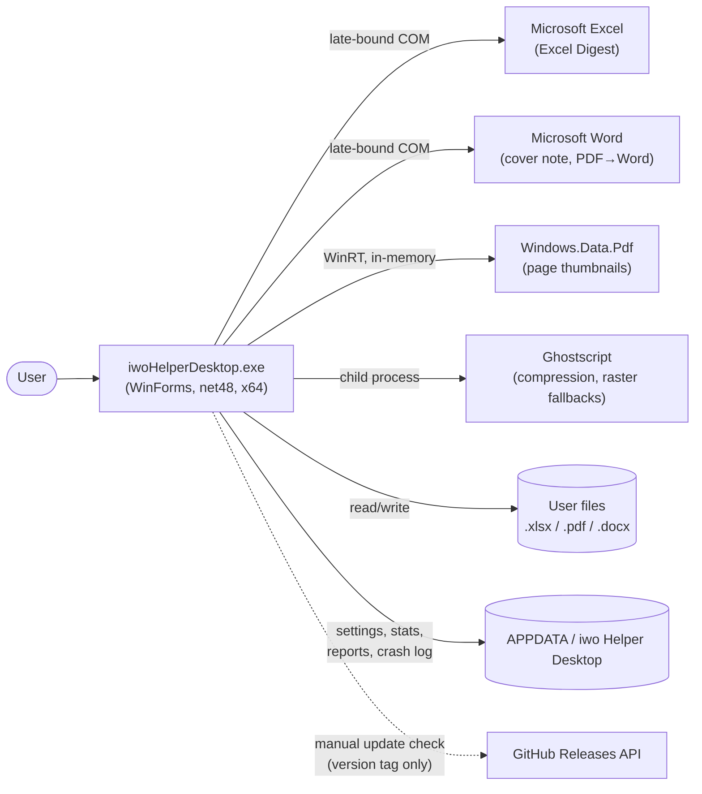
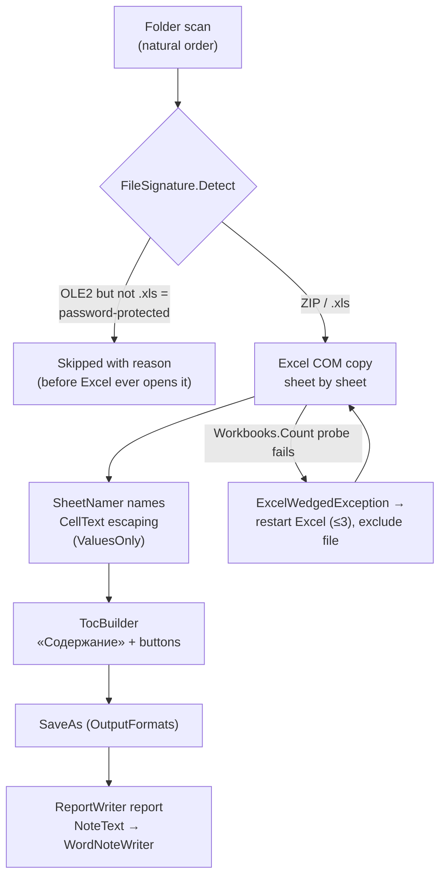
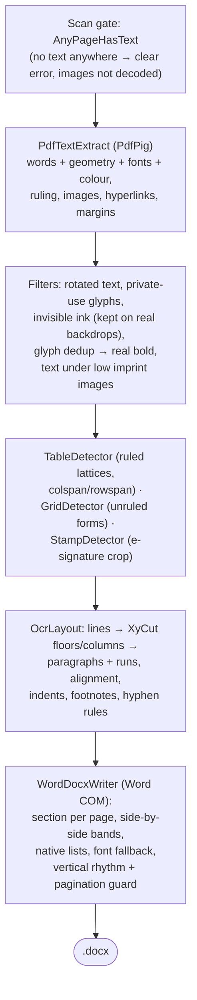

# Architecture

This document is the map of the codebase: what the application is made of, how the pieces
talk to each other, and which rules keep it working. It is written for someone about to
read or change the code. For **what the app does** (features, downloads, usage) see the
[README](../README.md); for the change history see the [CHANGELOG](CHANGELOG.md).

> **Maintenance policy:** this file describes the *shape* of the code — layers, pipelines,
> invariants. Update it when the shape changes (a new tool, a new pipeline stage, a new
> external dependency), not on every release.

## Contents

- [Bird's-eye view](#birds-eye-view)
- [System context](#system-context)
- [Tech stack and constraints](#tech-stack-and-constraints)
- [Code map](#code-map)
- [Architecture invariants](#architecture-invariants)
- [Tool pipelines](#tool-pipelines)
- [Office COM layer](#office-com-layer)
- [Threading model](#threading-model)
- [Error handling and resilience](#error-handling-and-resilience)
- [Persistence and privacy](#persistence-and-privacy)
- [Localization](#localization)
- [Testing](#testing)
- [Build, CI and release](#build-ci-and-release)
- [Repository layout](#repository-layout)
- [Extension points](#extension-points)
- [Key design decisions](#key-design-decisions)

## Bird's-eye view

iwo Helper Desktop is a single Windows Forms executable that hosts **four independent
offline tools** behind one start screen:

1. **Excel Digest** — merges sheets of every workbook in a folder into one file (Excel COM).
2. **PDF Merge** — combines pages of several PDFs, copied as-is (PdfSharp).
3. **PDF Split** — extracts pages / splits by ranges, every N, or bookmarks (PdfSharp).
4. **PDF → Word** — rebuilds a born-digital PDF into an editable `.docx`
   (PdfPig extraction → own layout analysis → Word COM writing).

Cross-cutting services: optional **PDF compression** (Ghostscript as a child process),
page **thumbnails** (WinRT `Windows.Data.Pdf`), a GOST-styled Word cover note, reports,
usage counters, a manual update check, and a Russian/English UI.

The guiding principles, in priority order:

- **Offline and private.** No telemetry, no background network. The only network call is
  the manual update check. Files are written only to user-chosen folders and `%APPDATA%`.
- **Zero footprint.** Target machines have nothing installed: .NET Framework 4.8 ships
  with Windows 10/11, Office is driven late-bound (no interop assemblies), managed
  libraries are embedded into the single exe, installs are per-user without admin.
- **Fidelity first.** PDF pages are copied without recompression; PDF → Word reproduces
  the source layout (columns, tables, spacing, fonts) rather than dumping plain text.
- **Survive real-world input.** Broken, password-protected and hostile files are detected
  up front; a wedged Excel is restarted; results are validated before replacing anything.
- **Logic lives in pure functions** so it can be unit-tested without Office (see
  [Testing](#testing)).

## System context

| Dependency | Kind | Used for | Needed by |
|---|---|---|---|
| Microsoft Excel | COM, late-bound | copying sheets with full formatting | Excel Digest only |
| Microsoft Word | COM, late-bound | writing `.docx` (cover note, PDF → Word) | Excel Digest note, PDF → Word |
| PdfSharp (MIT) | embedded assembly | PDF page copy for merge/split | PDF Merge/Split |
| PdfPig (Apache 2.0) | embedded assemblies | glyph-level text extraction | PDF → Word |
| `Windows.Data.Pdf` (WinRT) | OS component | rendering page thumbnails | all PDF tools |
| Ghostscript (AGPL) | separate process | image downsampling, raster fallbacks | compression (optional), PDF → Word stamps |
| GitHub Releases API | HTTPS, manual | latest version tag | update check only |

Excel and Word are **optional**: PDF Merge, Split and Compression run without any Office.

## Tech stack and constraints

- **C# 7.3 on .NET Framework 4.8, WinForms, x64 only.** net48 is preinstalled since
  Windows 10 1903, so nothing needs installing. `LangVersion` is pinned — do not use
  newer syntax. x64 is explicit (`Prefer32Bit=false`): the installer bundles a 64-bit
  Ghostscript, and a silently 32-bit process would break compression in the field.
- **One exe.** All managed dependencies (`build/PdfSharp.dll`, `build/pdfpig/*` — 12
  PdfPig assemblies plus net48 polyfills such as `System.Memory`) are embedded as
  resources and resolved by name at runtime by `src/EmbeddedAssemblies.cs`. This also
  removes the need for binding redirects. Services that touch PdfSharp types call
  `EmbeddedAssemblies.Ensure()` first behind `[MethodImpl(NoInlining)]` gates, so the JIT
  never sees a library type before the resolver is registered.
- **Office through `dynamic`** (late binding, `Microsoft.CSharp`): no PIA/interop
  packages, builds on machines without Office, works with any Office version. The price
  is a set of strict usage rules — see [Office COM layer](#office-com-layer).
- **WinRT via `Microsoft.Windows.SDK.Contracts`** — compile-time only; the runtime
  projection is part of .NET Framework.
- Deterministic release build, no PDBs, output flattened to `dist\iwoHelperDesktop.exe`.

## Code map

Everything lives in a single project (`iwoHelperDesktop.csproj`, namespace
`ExcelMerger` — the historical name of the first tool). `src/` is flat; the layers below
are conceptual.

### Application shell

| File | Responsibility |
|---|---|
| `Program.cs` | Entry point. Parses CLI flags, installs `CrashReport`, initializes `Loc`, then runs the GUI (`ShellContext`) — or a headless mode: `--cli` (scripted Excel Digest), `--selftest` (create every window unshown), `--pdfcheck` / `--pdftextcheck` / `--thumbcheck` / `--gscheck` (embedded-dependency probes used by CI). Headless modes leave via `FastExit.Now`. |
| `ShellContext.cs` | `ApplicationContext` that owns the hub and all tool windows (independent, non-modal). Reopens the hub, focuses an already-open tool, rebuilds windows on language change (active window last; busy windows deferred), exits when the last window closes. |
| `ToolRegistry.cs` | Live-window registry keyed by tool id; prevents duplicate windows. |
| `StartForm.cs` | The hub: four `ChoiceCard`s (`excel`, `pdf`, `split`, `ocr`), language globe, menu. |
| `IBusyAware.cs` | Marker for windows running a long operation (skipped by the language rebuild). |
| `FastExit.cs` | Hard process exit for headless modes — avoids WinRT finalization crashes on CLR unload. |
| `CrashReport.cs` | Global exception handlers: branded dialog on the UI thread, silent log otherwise; `%APPDATA%\…\crash.log` with size rotation. |
| `UserSettings.cs`, `AppPaths.cs` | `settings.txt` (language, remembered options) and all `%APPDATA%` paths. |
| `UsageStats.cs` | Local operation counters in `stats.txt`, guarded by a cross-process mutex; optional auto-clear. |
| `UpdateChecker.cs` | Manual check: reads the latest release tag from the GitHub API, compares, offers to open the Releases page. Pure `ParseTag`/`IsNewer` for tests. |
| `Loc.cs`, `Flags.cs` | Localization catalog and GDI-drawn menu flags — see [Localization](#localization). |
| `Theme.cs`, `Ui.cs`, `HelpMenu.cs` | Palette, DPI/layout helpers, the shared ☰ menu. |

### UI toolkit (owner-drawn, shared by all tools)

`HeaderBand` (gradient window header), `ChoiceCard`, `RoundedButton`, `AccentCheckBox`,
`JustifiedLabel`, `WindowChrome` (title-bar colouring), `WindowFlasher` (completion
flash), `TaskbarProgress` (`ITaskbarList3`), `MessageForm`/`Dialogs` (branded message
boxes), `AboutForm`, `StatsForm`, `FolderPicker`, `CompressionPicker`, `ThumbZoom`.

### Excel Digest

| File | Responsibility |
|---|---|
| `MainForm.cs` | Tool window: folder/output pickers, the one file list (order + per-file results), progress, report/note actions. |
| `MergeService.cs` | The engine (UI-free). Owns the Excel instance and the whole run: pre-filtering, per-file copy, retry of skipped files, self-healing restarts. Defines `MergeOptions`, `MergeResult`, `MergeException` (user-facing, localized), `ExcelWedgedException`. |
| `SourceFileList.cs`, `ListReorder.cs`, `NaturalStringComparer.cs` | File list model, reorder ops, Explorer-style ordering (`StrCmpLogicalW`). |
| `FileSignature.cs` | Container sniffing (ZIP / OLE2 / other) — rejects broken and password-protected files *before* Excel opens them. |
| `SheetNamer.cs`, `CellText.cs`, `OutputFormats.cs` | Legal/unique sheet names (31 chars, `_2` suffixes), cell-entry escaping, `XlFileFormat` mapping. |
| `TocBuilder.cs` | The «Содержание» sheet: hyperlinked table of contents, per-sheet return buttons, frozen header. |
| `ReportWriter.cs` | Plain-text run report; keeps the three latest in `%APPDATA%\…\reports`. |
| `NoteText.cs`, `WordNoteWriter.cs` | Cover-note content (pure) and its GOST R 7.0.97-2016 rendering through Word COM. |

### Office COM infrastructure

| File | Responsibility |
|---|---|
| `ComSafe.cs` | `Release(object)` / `Collect()` — deterministic RCW release. |
| `ComMessageFilter.cs` | `IOleMessageFilter` that auto-retries `SERVERCALL_RETRYLATER` (busy Excel, AV scans) instead of surfacing `RPC_E_CALL_REJECTED`. |
| `WordCom.cs` | The one place that starts/quits Word and hosts the write-a-docx skeleton shared by `WordNoteWriter` and `WordDocxWriter`. |

### PDF: shared plumbing

| File | Responsibility |
|---|---|
| `EmbeddedAssemblies.cs` | Runtime resolver for the embedded PdfSharp/PdfPig assemblies. |
| `PdfToolFormBase.cs` | Base class of all PDF tool windows: thumbnail grid, zoom slider, compression picker, status/progress strip, drag-and-drop, hotkeys, background-work lifecycle. |
| `PdfPageGrid.cs`, `PdfPageOrder.cs` | Virtualized thumbnail grid with selection/reordering; the page-order model (`PdfPageRef` = source file + page index) shared by merge and PDF → Word. |
| `PdfThumbnailRenderer.cs`, `LruCache.cs` | WinRT rendering **from memory** (see invariants), LRU of open documents (6) and rendered tiles. |
| `Ghostscript.cs` | Locates gs (bundled → registry → `Program Files` → user profile → `PATH`) and runs it with a timeout. |
| `PdfCompression.cs` | `pdfwrite` downsampling (`/ebook`, `/screen`), PDF 1.4 output; the result replaces the original only if it is a valid PDF **and** strictly smaller. |
| `PageRasterizer.cs` | Renders a page region to PNG via gs — the raster fallback used for soft-masked images and text stamps. |
| `PdfDrop.cs`, `PageRanges.cs`, `PdfProbe.cs` | Drag-and-drop extraction, `1,3-5`-style range parsing, a tiny generated PDF for self-checks. |

### PDF Merge and Split

`PdfMergeForm` / `PdfMergeService` (load page sizes, copy pages as-is in shown order),
`PdfSplitForm` / `PdfSplitService` (extract selection, split by ranges / every N /
top-level bookmarks). Both compress optionally and never modify the source.

### PDF → Word pipeline

| File | Responsibility |
|---|---|
| `OcrForm.cs` | Tool window: multi-file thumbnail grid, cross-file page ordering, convert action. |
| `PdfToWordService.cs` | Orchestrator: scan gate (`AnyPageHasText`), per-source extraction cache, page assembly in shown order, progress split extraction/writing. The single point where a scanned-PDF (OCR) branch would plug in later. |
| `PdfTextExtract.cs` | PdfPig-based extraction to `PdfPageText`: words with geometry/font/colour, ruling lines, images, hyperlinks, page margins. Filters: rotated text, private-use glyphs, invisible ink (kept on real backdrops), doubled glyphs → real bold, text under low imprint images. Detects the text e-signature stamp and carries it as a rendered crop. |
| `OcrLayout.cs` | Layout analysis: words → lines → blocks → paragraphs (`OcrParagraph`/`OcrRun`). Paragraph boundaries (gaps, indents, short lines, list markers, deliberate hard breaks), alignment classification (left/justify/centre), per-paragraph first-line indents, super/subscript and footnote marks, Cyrillic-aware hyphenation rules. |
| `XyCut.cs` | Recursive X-Y cut: whitespace bands split a page into floors and columns; `OrderTree` keeps side-by-side siblings marked for band layout. |
| `TableDetector.cs` | Ruled tables: connected ruling components on a spatial grid, ≥2×2 cell lattice, colspan/rowspan from missing borders, per-cell text. Also turns lone rules into `____` placeholders and feeds `UnderlineDetector`. |
| `GridDetector.cs` | Unruled label/value grids (receipt-style forms) → borderless tables with kept row spacing. |
| `StampDetector.cs`, `ListMarker.cs`, `UnderlineDetector.cs`, `GlyphDedup.cs`, `FontNames.cs`, `MathUtil.cs`, `OcrTable.cs`, `PdfLine.cs` | Focused helpers: e-signature stamp region, list-marker recognition, underline mapping, glyph dedup, font-name normalization, medians, table/line models. |
| `WordDocxWriter.cs` | Writes the `.docx` through Word COM: a section per PDF page (size, orientation, margins), zeroed Normal style, `OrderTree`-driven side-by-side bands and `CoalesceRowBands` as borderless tables, native Word lists (start value set on the document's own list template), fonts normalized with an installed-font fallback to Times New Roman (keeps Cyrillic off the East-Asian justification path), source vertical rhythm with a `FitSpacingToPages` pagination guard. |

> Naming note: the `Ocr*` files predate the feature's final shape — the tool handles
> **born-digital** PDFs; no OCR happens today. The orchestrator comment marks where a
> real OCR branch would attach.

## Architecture invariants

- **Services are UI-free and forms are logic-free.** Forms gather input, start a worker,
  render progress/results. Everything decidable is a pure static function under unit
  tests; everything with side effects lives in a `*Service`/writer class.
- **All Office COM sits behind `MergeService` / `WordCom`** with `ComSafe` +
  `ComMessageFilter`. Forms never touch COM objects.
- **COM calls run on dedicated STA worker threads**, never on the UI thread and never on
  thread-pool (MTA) threads.
- **WinRT PDF documents are always loaded from memory** (`InMemoryRandomAccessStream`),
  never from a file path: `LoadFromFileAsync` keeps the file memory-mapped, which would
  make a shown file impossible to overwrite (`ERROR_USER_MAPPED_FILE`).
- **Sources are never modified.** Every tool writes new files; compression replaces its
  own output only after validation.
- **User-visible strings go through `Loc.T`** (both languages); *generated documents*
  (cover note, TOC sheet, reports) are deliberately Russian regardless of UI language —
  they follow the Russian office-document standard (GOST R 7.0.97-2016).
- **No new runtime dependencies** unless embedded as a resource and MIT-compatible;
  AGPL code (Ghostscript) is only ever invoked as a separate process.

## Tool pipelines

### Excel Digest

Resilience is the point of this pipeline: signature pre-filtering keeps poisonous files
away from the shared Excel instance; `ComMessageFilter` absorbs busy-server rejections;
a responsiveness probe between files catches a wedged Excel, which is then restarted
with the offending file excluded; skipped files can be retried later without a full
rebuild (`RetrySkipped` merges old and new results). All failure reasons flow as one
wording into the list UI, the report and the cover note.

### PDF Merge and Split

PdfSharp opens sources read-only and copies page objects as-is — scans, stamps and
signatures are not re-encoded. The thumbnail grid renders through WinRT in a background
thread with an LRU document cache; merge writes pages in the exact shown order (across
files), split writes selections/ranges/every-N/bookmark chapters. Optional Ghostscript
compression runs per output file with validation before replacing.

### PDF → Word

Two decisions define this pipeline:

- **Geometry over text order.** PdfPig yields glyphs in drawing order, which is
  meaningless for layout. Everything the writer needs — reading order, columns,
  paragraphs, tables, alignment — is *re-derived from coordinates* (X-Y cut, gap
  statistics, edge alignment), with thresholds expressed in em/font-size units so they
  scale with the document.
- **Word writes the document.** The `.docx` is produced by Word itself (COM), not by
  emitting OOXML: Word owns list numbering, spacing and font substitution, so the result
  behaves natively when edited — and the app needs no OOXML library.

### PDF Compression

`Ghostscript.Exe` resolution order: bundled (`<app>\gs\bin`, from the installer) →
registry → `Program Files\gs` → user profile → `PATH`. Arguments produce PDF 1.4 via
`pdfwrite` with `/ebook` (~150 DPI) or `/screen` (~72 DPI); `-dSAFER`; bundled runs get
explicit `-I` resource paths. The output replaces the target only if it is a valid PDF
and strictly smaller — an already-optimized file is left untouched.

## Office COM layer

Late-bound COM is powerful and unforgiving; these rules are load-bearing:

- **Store the reference as `object` before `Close`/`Quit`.** Any `dynamic` operation on
  a closed COM object throws `COMException 0x80010114` *at bind time* — before entering
  the method, past your `try`. Release through `ComSafe.Release(object)`.
- **Always `Quit()` + `Release` + `ComSafe.Collect()` in `finally`.** A leaked
  `EXCEL.EXE`/`WINWORD.EXE` keeps running headless and can wedge every later COM call on
  the machine.
- **Register `ComMessageFilter` around COM work.** It retries `SERVERCALL_RETRYLATER`
  (up to ~20 s) instead of failing with `RPC_E_CALL_REJECTED` when Excel is busy or an
  antivirus is scanning.
- **Escape all text entering cells** through `CellText.EscapeForEntry`/`EscapeValues` —
  a value starting with `=` becomes a formula, a leading `'` silently disappears.
- **Wait for readiness under load** (`WaitExcelReady` polls `Workbooks.Count`) — a
  freshly started Excel may reject calls for seconds.

## Threading model

- **UI thread** — WinForms only; results marshalled back via `BeginInvoke`, progress
  callbacks throttled; taskbar progress mirrors the in-window bar.
- **STA worker threads** — one per Office job (merge, note, PDF → Word write): COM
  apartments require it.
- **Thumbnail thread** — one background renderer per grid with a work queue; joined
  (with a timeout) before the form disposes.
- **Cross-process safety** — `stats.txt` increments run under a named mutex, so two app
  copies don't lose counts.
- **Headless exits** — CLI/self-check modes end with `FastExit.Now` to skip WinRT
  finalizers that can crash CLR unload.

## Error handling and resilience

- `MergeException` — the user-facing error type: localized message, no stack trace shown.
- Transient vs permanent open failures: `IsPermanentOpenError` stops pointless retries
  (wrong password, corrupt file) while `SERVERCALL_RETRYLATER`-class errors retry.
- `CrashReport` catches everything unhandled: a branded dialog on the UI thread, a
  silent entry otherwise; `crash.log` rotates by size.
- External results validated before commit: compression output must parse as PDF and be
  smaller; reports rotate (3 latest); low-disk-space stops a merge up front.

## Persistence and privacy

Everything lives under `%APPDATA%\iwo Helper Desktop`: `settings.txt` (language and
remembered options), `stats.txt` (local counters, optional auto-clear), `reports\`
(three latest merge reports), `crash.log`. Nothing else is written outside user-chosen
output folders. The only network code is `UpdateChecker` — a manual GET of the latest
release tag; it opens the browser rather than downloading. Details: [PRIVACY](PRIVACY.md).

## Localization

`Loc` holds the entire catalog (`key → [ru, en]`) in code; `Loc.T(key)` resolves at
paint time, `Loc.Set` persists the choice and raises `Loc.Changed`. `ShellContext`
rebuilds open windows on the event (deferred via `BeginInvoke`), recreating the active
window last so z-order is kept; windows implementing `IBusyAware` are left alone until
their operation finishes. Menu flags are drawn with GDI (`Flags`) because WinForms
renders emoji flags as letters. Generated documents intentionally stay Russian (see
invariants).

## Testing

The pyramid, bottom-up:

1. **Unit tests** — `tests/UnitTests.cs` (~200 tests, custom exe runner, zero
   dependencies, no Office) covering the pure core: layout analysis, table/grid/stamp
   detection, X-Y cut, list markers, naming/escaping/ranges, tag parsing, spacing rules.
   Run by `tests\build_tests.cmd`; this is what CI executes.
2. **Self-checks in the exe** — `--selftest` (every window created headless),
   `--pdfcheck` / `--pdftextcheck` / `--thumbcheck` / `--gscheck` (embedded PdfSharp,
   embedded PdfPig extraction, WinRT thumbnail render from memory, Ghostscript
   round-trip). CI runs each as a separate step.
3. **Integration** — `tests/verify*.ps1` drive the real exe against generated corpora
   and assert on the produced `.xlsx`/`.docx`/`.pdf` (PdfPig-based checks included).
   They need installed Excel/Word, so they run locally only: `tests\run_all.cmd` — the
   full pyramid plus a zombie-process check at the end.

The working rule: new logic lands as pure functions with unit tests; behaviour that
needs Office gets a `verify` script.

## Build, CI and release

- **Build:** `build.cmd` → `dotnet build -c Release` → single `dist\iwoHelperDesktop.exe`
  (embedded resources included). Needs only the .NET SDK.
- **CI** (`.github/workflows/ci.yml`, windows-latest): build → unit tests → GUI smoke →
  embedded-dependency probes → Ghostscript round-trip → installer compile check (Inno
  Setup, version taken from the built exe) → artifacts. CI never releases.
- **Release** (local, maintainer-only — the self-signed certificate lives on one
  machine): bump `src/AssemblyInfo.cs`, add a CHANGELOG section, then
  `tools\make_release.ps1 -Publish` chains build → sign exe → `stage_gs.ps1` → ISCC →
  sign installer → tag `vX.Y.Z` → GitHub release with CHANGELOG-derived notes.
  Step-by-step: [RELEASING](RELEASING.md).
- **Versioning:** SemVer; `docs/CHANGELOG.md` follows Keep a Changelog and is the single
  source of release notes.

## Repository layout

| Path | Contents |
|---|---|
| `src/` | All application sources (one project, flat). |
| `tests/` | `UnitTests.cs` + runner project, `verify*.ps1` integration scripts, corpus generators. |
| `tools/` | Maintainer scripts: `make_release.ps1`, `make_installer.ps1`, `sign.ps1`, `stage_gs.ps1`, `make_wizard_images.ps1`. |
| `build/` | Build inputs: icon, manifest, vendored `PdfSharp.dll`, `pdfpig/*`. |
| `installer/` | Inno Setup script + wizard images; `gs/` is staged locally and gitignored. |
| `docs/` | This file, `CHANGELOG.md`, `PRIVACY.md`, `RELEASING.md`, screenshots. |
| `dist/` | Build output (gitignored). |
| `.github/workflows/` | `ci.yml`. |

## Extension points

- **A new tool**: a `ChoiceCard` on `StartForm` calling
  `ShellContext.OpenTool(key, name, factory)`; PDF-shaped tools inherit
  `PdfToolFormBase` and get the grid/zoom/compression/progress shell for free.
- **Scanned-PDF OCR**: the branch point is `PdfToWordService.Convert` (documented in
  code). The layout and writing stages are input-agnostic — they consume words with
  geometry, wherever those come from.
- **A new compression level**: `PdfCompression.BuildArguments` + `CompressionPicker`.
- **A new UI language**: extend `Lang` and the `Loc` catalog rows (each key holds one
  string per language), add the menu item/flag.

## Key design decisions

| Decision | Why |
|---|---|
| .NET Framework 4.8, not .NET 8 | Preinstalled on every target machine — a portable exe with zero prerequisites. |
| Late-bound COM, no interop assemblies | Builds without Office; version-independent; one exe. |
| Word writes the `.docx` (COM), not an OOXML library | Native list numbering, spacing and font substitution; fewer dependencies; the file behaves as if typed in Word. |
| Managed deps embedded as resources | Single-file distribution without ILMerge; resolver also kills binding-redirect pain. |
| WinRT for thumbnails, loaded from memory | In-box rasterizer (no native deps); memory loading avoids the user-mapped-file lock on shown files. |
| Ghostscript as a child process | Acrobat-grade downsampling; AGPL stays outside the MIT process boundary; graceful absence. |
| Custom exe test runner | Zero test-framework dependencies on net48; trivially runs anywhere, including CI. |
| Releases cut locally, CI validates only | Signing certificate never leaves the maintainer's machine. |
